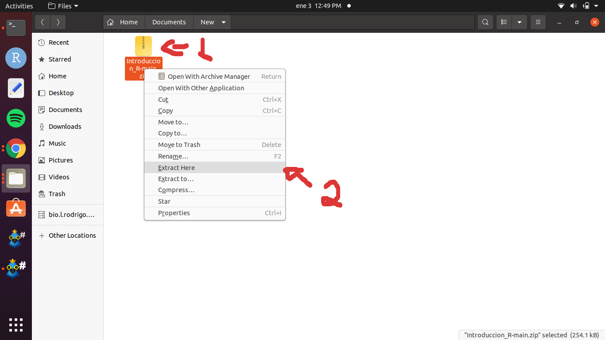
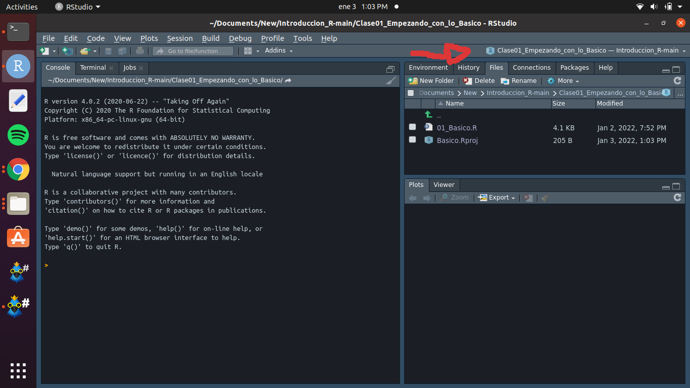

## R para Kary
### Bienvenido a nuestro curso de introducción a R!

Como objetivo para el 2022 mi novia desea aprender R y yo deseo ayudarle a hacerlo. Con eso en mente decidí aprovechar para conforme avancemos en sus cursos ir construyendo un repositorio de introducción a R para quienes también deseen aprender este lenguaje. Seguramente hay muchos otros cursos mejores, pero sabiendo que este curso esta pensando en ella, pueden asumir que esta construído con mucho cariño y planea ser muy entendible para ir guiando de la mejor forma que pueda quien desee seguirlo.

### ¿Porqué aprender R?

Esta pregunta es fácil de responder. Basta con [googlearla](https://www.google.com/search?q=porque+aprender+r&oq=porque+aprender+r&aqs=chrome..69i57j0i512j0i22i30l8.2693j0j7&sourceid=chrome&ie=UTF-8) y encontraremos varios blogs que hablan de las ventajas de aprender R. Cómo genetista R es junto con Bash y unos toques de otros lenguajes mi pan de cada dia, pero viendo los análisis que Kary (estudiando tratamiento de aguas residuales) hace, sé que también le será útil. R permite hacer análisis independientemente de donde vingan esos datos: biología, mercadotecnía, ingeniería, etc. Es más, yo he usado R hasta para ayudarle a un primo a [analizar acciones](https://cran.r-project.org/web/packages/BatchGetSymbols/BatchGetSymbols.pdf) de las bolsas de EUA. Algunos puntos de lo que sin llegar a ser experto (es decir, lo que yo he hecho) que se puede hacer en R:

- Exploración de datos y obtención de estadisticos de resumen.
- Realizar pruebas estadísticas frecuentistas básicas.
- Visualizar datos mediante la elaboración de gráficos.
- Evaluar modelos que describan el comportamiento de nuestros datos.
- Implementar métodos de aprendizaje computacional (Machine Learning).
- Aprovechar las 18,650 (a Enero del 2022) paqueterías en el repositorio [CRAN](https://cran.r-project.org/), MÁS todas las demás en otros repositorios como [Bioconductor](https://www.bioconductor.org/) o GitHub.
- E incluso contribuir uno mismo construyendo funciones o paqueterías nuevas para analizar sets de datos.

Lo mejor, todo esto es **GRATIS**.

### Antes de empezar:
Lo primero que necesitamos es tener instalado R y RStudio en nuesta computadora. R funciona en un entorno independiente a nuestro sistema operativo por lo que puede ser trabajado en Windows, Mac y distribuciones Linux. Agrego [aquí](https://www.youtube.com/watch?v=D9Bp11iZssc) un video con las instrucciones de instalación, pero también puedes seguir las siguientes pasos.

#### Instalación de R
R es como tal el lenguaje que aprenderemos a usar y el motor con el que realizará todos los procesos que aprenderas a usar. Para instalarlo:
1. Entra al siguiente vínculo: [https://cloud.r-project.org/](https://cloud.r-project.org/).
2. Selecciona el sistema operativo con el que estas trabajando.

3. Posteriormente cada sistema operativo tendrá sus propias instrucciones. Aquí seguiré con la instalación de Windows siendo el sistema más popular.
4. Daremos clic en "Instalar por primera vez".

5. Finamente daremos en clic en descargar R para Windows. Es probable que la versión mas reciente de R al momento de que leas este tutorial es diferente a la que había en Enero del 2022. No te preocupes, todo lo fundamental seguirá funcionando de la misma forma.

#### Instalación de RStudio
Mientras R es el motor que usaremos en nuestros calculos RStudio funciona como un tablero que nos permitirá visualizar de forma más eficiente nuestro código y programar de forma más sencilla. No es escencial contar con RStudio y algunos puristas prefieren trabajar únicamente con R, pero en mi experiencia resulta muy conveniente y no le he visto ninguna desventaja a implementarlo. Para instalar RStudio haremos lo siguiente:

### ¿Cómo funciona el curso?
La forma más recomendable para trabajar el curso es descargar este repositorio completo. Mientras este repositorio vaya actualizandose quiere decir que cada vez que termine una nueva sección tendrás o que descargar nuevamente el repositorio o descargar solamente los scripts de las clases que no tengas. Para descargar todo el repositorio haremos lo siguiente:

1. Daremos clic en el botón verde de código y posteriormente le pediremos a R que descargue todo el repositorio el un comprimido ZIP.

2. Exploraremos las carpetas de nuestro sistema y escogeremos el lugar donde guardaremos el curso. Finalmente daremos clic en el botón de "Save".

3. Tras completar la descarga daremos clic derecho en la carpeta comprimida y la descomprimiremos en la ubicación que hemos escogido. Al descomprimirla podemos usar el descompresor default de nuestracomputadora o algun programa como WinRar o WinZip.

4. ¡Y listo! todo el curso se encuentra ya en tu computadora. Dentro observaras las carpetas de cada clase.

5. Al acceder a cada una de ellas observaras dos archivos. Uno con extensión ".R" y otro con extensión ".RProj". En el ejemplo puedes ver para la primera clase el archivo `01_Basico.R` y  `Basico.Rproj`. El primero es un archivo de texto que contiene el script con las instrucciones de ese curso, mientras que el segundo es un archivo de proyectos de RStudio. Después veremos cuál es la función de este segundo objeto, pero por mientras es importante que al momento de iniciar una clase **sea el archivo .Rproj el que abramos con RStudio**. Trabajar con archivos de proyectos es una muy buena práctica al momento de que queramos compartir con otras personas nuestros códigos.

6. Al dar doble clic y abrir el proyecto de RStudio nos abrirá dicho programa. Podremos comprobar que todo ha funcionado correctamente si nos aparecé dentro de RStudio ek nombre de la clase que seleccionamos.

### Conociendo la interfaz de R y de RStudio
